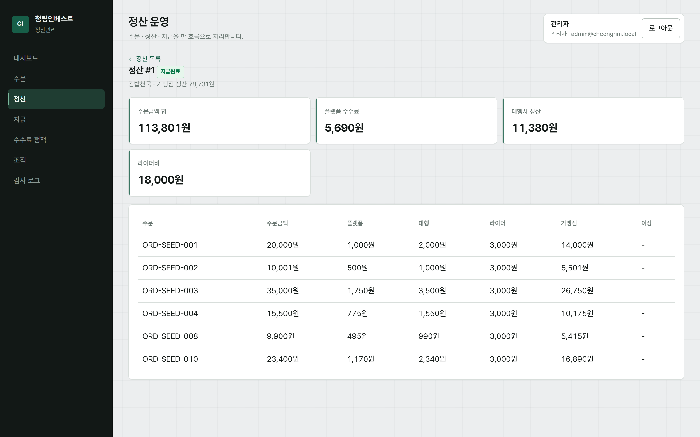

# 배달대행 정산관리 플랫폼

[](https://github.com/inchoriya/cheongrim-settlement/actions/workflows/ci.yml)

배달대행 주문의 수수료를 계산하고, 주간 정산을 만든 뒤 가맹점에 지급하는 흐름까지 구현한 B2B 정산 시스템입니다.  
청림인베스트 채용 공고의 핵심 사업(배달대행 정산 관리)을 기준으로 설계했습니다.

데모 영상: [docs/demo-assets/cheongrim-demo.webm](./docs/demo-assets/cheongrim-demo.webm)



> 주문 단위 수수료 분해 화면. 각 행에서 `주문금액 = 플랫폼 + 대행 + 라이더 + 가맹점`이 성립합니다.  
> 전체 화면은 [docs/screenshots/](./docs/screenshots/)에 있습니다.

## 무엇을 다루나

```text
주문 등록 → 수수료 정책 적용 → 정산 배치 → 확정/보류 → 지급
```

역할은 세 가지입니다.

| 역할 | 할 수 있는 일 |
|------|----------------|
| 관리자 | 전체 조회, 정산 배치·확정, 지급, 정책·조직 관리 |
| 대행사 | 소속 주문 등록/CSV, 소속 정산·가맹점 조회 |
| 가맹점 | 본인 매장 주문·정산만 조회 |

역할 문자열만이 아니라, API에서 `agencyId` / `merchantId`로 데이터 범위를 제한합니다.

## 기술 스택

- Backend: Java 17, Spring Boot 3, Spring Security(JWT), JPA
- Frontend: React (Vite)
- DB: 로컬 H2 / Docker MySQL 8, Redis(Compose)
- 지급: `PayoutGateway` 포트 — 기본 Mock, 설정 시 토스 지급대행 어댑터
- 인프라: Docker Compose, GitHub Actions CI

## 실행 방법

### 로컬 개발

```powershell
# 터미널 1 — API (JDK 17, JAVA_HOME은 jdk 루트)
cd backend
.\gradlew.bat bootRun

# 터미널 2 — UI
cd frontend
npm install
npm run dev
```

- UI: http://localhost:5173  
- API: http://localhost:8080  

### Docker

```powershell
docker compose up --build -d
```

- UI: http://localhost  

> Windows에서 Docker Desktop은 WSL2가 필요합니다.

## 데모 계정

비밀번호: `Demo1234!`

| 역할 | 이메일 |
|------|--------|
| 관리자 | admin@cheongrim.local |
| 대행사 | agency@seoul.local |
| 가맹점 | merchant@kimbap.local |

시드에 대행사·가맹점·수수료 정책·주문 샘플(`ORD-SEED-001`~`010`, 2026-08-01~08-08)이 들어 있습니다.  
관리자로 로그인한 뒤 정산 메뉴에서 해당 기간으로 배치를 실행하면 바로 확인할 수 있습니다.

짧은 시연 순서와 계산 예시는 [docs/demo.md](./docs/demo.md)를 보면 됩니다.

## 설계에서 신경 쓴 점

1. 정산 계산을 `SettlementCalculator`로 분리하고, 문서의 수치 예시로 단위 테스트
2. 금액은 원 단위 `Long`, 수수료율은 bps + `floor`로 맞춰 반올림 분쟁을 줄임
3. 정산 확정 이후 같은 기간 재배치를 막아 금액이 바뀌지 않게 함
4. CSV 업로드는 행 단위 트랜잭션으로 부분 성공 처리
5. 지급은 인터페이스로 두고 Mock과 토스 구현을 설정으로 교체

## 테스트

```powershell
cd backend
.\gradlew.bat test
```

CI: `.github/workflows/ci.yml` (백엔드 테스트 + 프론트 빌드)

## 문서

| 문서 | 내용 |
|------|------|
| [docs/demo.md](./docs/demo.md) | 데모 순서, 계정, 영상 |
| [docs/settlement-rules.md](./docs/settlement-rules.md) | 정산 계산식·상태·수치 예시 |
| [docs/architecture.md](./docs/architecture.md) | 구조, 권한, 배치·지급 |
| [deploy/](./deploy/) | EC2용 Compose 배포 스크립트 |

## 디렉터리

```text
backend/     Spring Boot API
frontend/    React 관리 화면
docs/        설계·데모 문서, 데모 영상
deploy/      배포 스크립트·환경변수 템플릿
```
